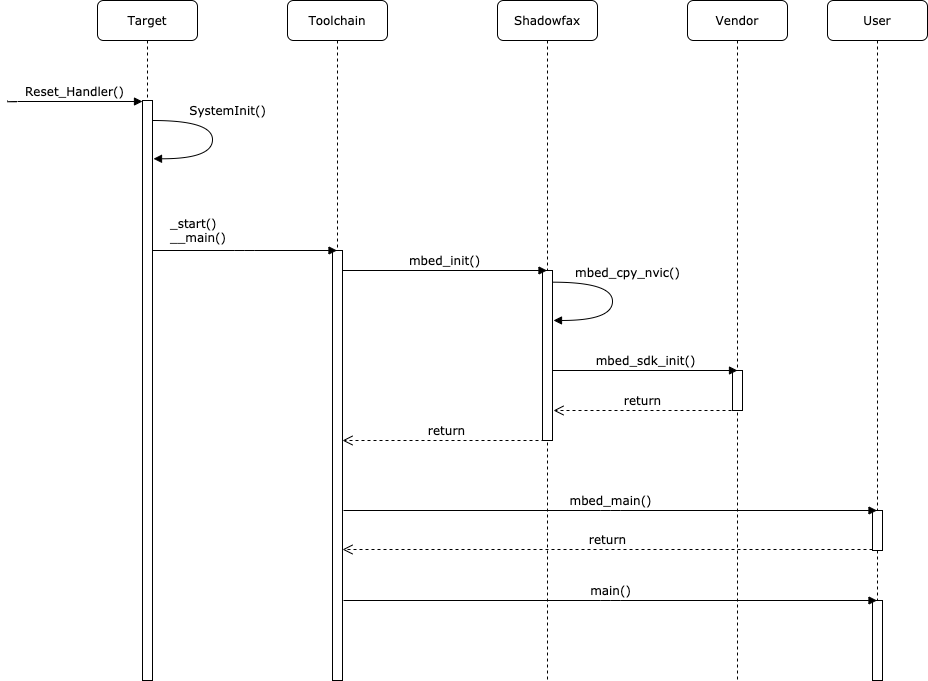

# Bootstrap

## Boot sequence

Most supported platforms use the default Arm Cortex-M boot approach, where the core starts executing the reset vector after power up. The Reset ISR is defined for each platform by the vendor (basing on CMSIS-Core template). The Reset vector is responsible for low level platform init and then calling in libc (__main).

## Entry points

There are a number of functions that vendors can provide definitions for to execute code before the `main()` function:
- `Reset_Handler` and `SystemInit`: The reset handler is executed after CPU reset and typically calls the `SystemInit` function. `SystemInit` performs platform-specific low level initialisation.
- `mbed_sdk_init`: Higher level platform init and making sure the platform is ready. Vendors can define this.
- `mbed_main`: Executed directly before `main`. Developers can define this.
- `main`: User application entry point called by the C run time library function `__main`.

As a developer you can use `mbed_main(void)` and `main(void)` as your entry points. When execution reaches these entry points, you can expect a fully initialized system that is ready to execute application code. The MCU-Driver-HAL boot sequence consists of three phases: platform setup, toolchain setup, starting the application. You can see these phases below:

1. Hardware platform setup.
   1. Configure clocks.
   1. Configure watchdog (if applicable).
   1. Turn on RAM (if applicable).
1. Toolchain setup.
   1. Initialize RAM.
   1. Initialize the C standard library.
   1. Call `mbed_init()`.
      1. Copy vector table to RAM.
      1. Initialize vendor SDK.
1. Application startup.
     1. Call `mbed_main()`.
     1. Call `main()`.

## Retargeting

MCU-Driver-HAL redefines multiple standard C library functions to enable them to work in a predictable and familiar way on embedded platforms:

- `stdin`, `stdout`, `stderr` - These file descriptors are pointing to the serial interface to enable users to use standard input/output functions, such as `printf` or `getc`.
- `fopen`, `fclose`, `fwrite`, `fread`, `fseek` and other standard file operations - Enable the user to work with the serial interface, as well as the built-in file system.
- `opendir`, `readdir`, `closedir` and other standard directory operations - Enable users to use built-in file system.
- `exit` - It causes the microcontroller to stop current execution, flush the standard file handles, close the semihosting connection and enter an infinite loop. If the return code indicates an error, the microcontroller blinks error patterns on the built-in LED.
- `clock` - Redefined to use the microcontroller's microsecond ticker.
