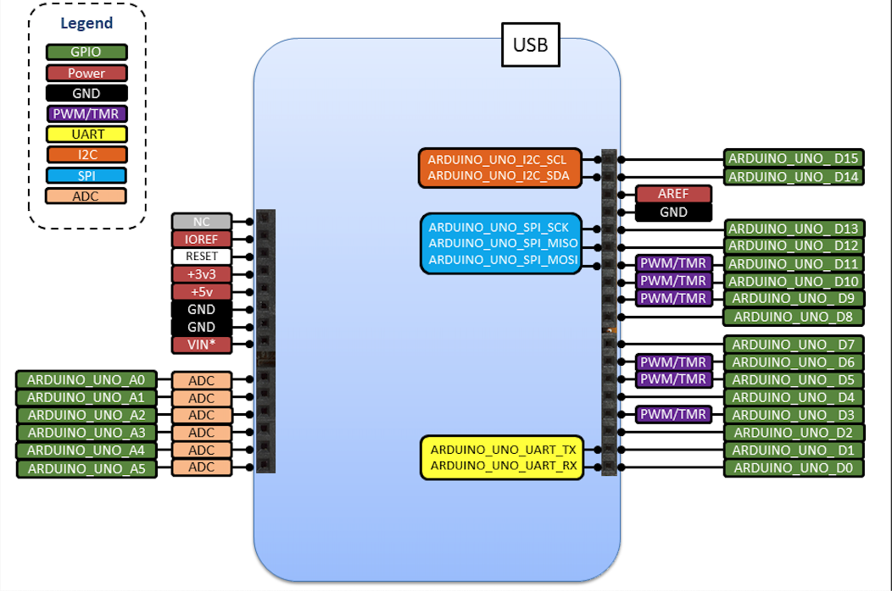

# Standard pin names

This porting guide aims to help vendors comply with the pin naming guidelines.

There is a set of generic guidelines that apply to all boards, and further sets of guidelines that additionally apply to boards that have certain compatible connectors.

## Generic Pin Names

The generic guidelines define rules for the naming of LED pins, button pins and UART pins. In summary, the rules are:
* LED pins are defined as `LEDn` (e.g. `LED1`)
* Button pins are defined as `BUTTONn` (e.g. `BUTTON1`)
* UART pins for console communication with host are defined as `CONSOLE_TX` and `CONSOLE_RX`
* Pin aliases at application level are encouraged (e.g. `#define RED_LED LED1`)
* Standard pin definitions use pre-processor definitions instead of C enumations (i.e "`#define LED1 ARDUINO_UNO_D13`" instead of "`enum LEDS { LED1 = ARDUINO_UNO_D13 }`")
* MCU pins can be assigned to no more than one LED, button or UART pin definition
* A pin cannot be assigned to itself
* A pin cannot be defined as `NC` (not connected)

### Definition of LEDs

Only add LEDs that are available on the board.  
Available onboard LEDs are defined as `LEDn` where `n` is a positive integer value starting from 1.  
I.e. `LED1`, `LED2`, etc.
This is an example on how to define LEDs in `PinNames.h`:
```c
// Px_xx refers to the processor pin connected to the LED
#define LED1 Px_xx
#define LED2 Px_xx
#define LED3 Px_xx
#define LED4 Px_xx
. 
. 
#define LEDN Px_xx
```

### Definition of buttons

Only add buttons that are available on the board.  
Buttons that are available on a board will be defined as `BUTTONn` where `n` is a positive integer value starting from 1.  
I.e. `BUTTON1`, `BUTTON2`, etc

This is an example on how to define buttons in `PinNames.h`:
```c
// Px_xx refers to the processor pin connected to the button  
#define BUTTON1 Px_xx
#define BUTTON2 Px_xx
#define BUTTON3 Px_xx
#define BUTTON4 Px_xx
.  
.  
#define BUTTONN Px_xx
```

### Definition of UART pins
Every board that implement the MCU-Driver-HAL includes a serial interface to connect the host PC. The serial connection to the host PC allows useful information about the application to be printed on the console.

The pins for the console serial interface are defined as `CONSOLE_TX` and `CONSOLE_RX`.

This is an example on how to define UART pin names in `PinNames.h`:
```c
typedef enum {
...
    // Px_xx refers to the processor pin connected to the UART
    CONSOLE_TX       = Px_xx,
    CONSOLE_RX       = Px_xx,
    ...
} PinName;
```

### Invalid definitions

If neither LEDs or buttons are available they should not be defined.
This allows for unavailable LEDs or BUTTONs to be detected during application compilation thus allowing the corresponding errors to be generated.
```c
#define LED1 PB_0  // LED1 is valid
#define LED2 LED1  // Invalid as it is an alias for an already defined MCU pin and LED2 does not exist on the board
#define LED3 PB_0  // Invalid as there is already a definition for that MCU pin and LED3 does not exist on the board
#define LED4 NC    // Invalid definition as LED4 does not exist
```


## Arduino Uno Pin Names
The Arduino Uno guidelines currently define rules for the naming of the Arduino Uno connector pins, the functionality that each pin must support and the definition of Arduino Uno pin aliases. In summary, rules that apply to all Arduino pins are:
* All `ARDUINO_UNO_Xn` pins are defined
* A pin cannot be assigned to itself
* A pin cannot be defined as `NC` (not connected)

The Arduino Uno connector is a standardised connector with a set amount of exposed functionality. To achieve meaningful portability of application code across various boards that are Arduino Uno compliant, the pin names used for the connector pins are common across these boards.

The following diagram shows the Arduino Uno standard for MCU-Driver-HAL boards:  
 

### Digital and Analog pins
* Pins must be defined in a `PinName` enum
* Digital pins must be defined as `ARDUINO_UNO_Dn` where `n` is a positive integer
* Analog pins must be defined as `ARDUINO_UNO_An` where `n` is a positive integer
* Analog pins must provide ADC functionality
* An MCU pin can be assigned to no more than one Arduino Uno pin

The Arduino Uno connector supports digital and analog pins.
The Arduino Uno (Rev3) form factor for MCU-Driver-HAL must support and define both `ARDUINO_UNO_D0`-`ARDUINO_UNO_D15` pins for digital GPIO and `ARDUINO_UNO_A0`-`ARDUINO_UNO_A5` pins for analog input as part of the default standard. However, it only supports analog inputs and does not support analog output functionality. The analog input functionality on the Arduino Uno connector can only be accessed on pins `ARDUINO_UNO_A0` to `ARDUINO_UNO_A5`. 

These pins should be defined in `PinNames.h` file within a `PinName` enum. The prefix `ARDUINO_UNO_` distinguishes these pins from pins defined for other custom or common connectors that may have similar pin names. 

The full digital and analog pin alias list for the Arduino Uno connector can be seen below:

|     Digital pins   |   Analog pins      |
|---                 |---                 |
|  `ARDUINO_UNO_D0`  |  `ARDUINO_UNO_A0`  |
|  `ARDUINO_UNO_D1`  |  `ARDUINO_UNO_A1`  |
|  `ARDUINO_UNO_D2`  |  `ARDUINO_UNO_A2`  |
|  `ARDUINO_UNO_D3`  |  `ARDUINO_UNO_A3`  |
|  `ARDUINO_UNO_D4`  |  `ARDUINO_UNO_A4`  |
|  `ARDUINO_UNO_D5`  |  `ARDUINO_UNO_A5`  |
|  `ARDUINO_UNO_D6`  |  `ARDUINO_UNO_A0`  |
|  `ARDUINO_UNO_D7`  |
|  `ARDUINO_UNO_D8`  |
|  `ARDUINO_UNO_D9`  |
|  `ARDUINO_UNO_D10` | 
|  `ARDUINO_UNO_D11` | 
|  `ARDUINO_UNO_D12` | 
|  `ARDUINO_UNO_D13` | 
|  `ARDUINO_UNO_D14` | 
|  `ARDUINO_UNO_D15` | 

The Arduino Uno connector supports many interfaces on specific pins for which pin aliases have been defined.

```c
#ifdef TARGET_FF_ARDUINO_UNO
// Arduino Uno (Rev3) pins
// Px_xx refers to the processor pin connected to the Arduino Uno (Rev3) connector pin
ARDUINO_UNO_D0 = Px_xx,
ARDUINO_UNO_D1 = Px_xx,
ARDUINO_UNO_D2 = Px_xx,
ARDUINO_UNO_D3 = Px_xx,
ARDUINO_UNO_D4 = Px_xx,
ARDUINO_UNO_D5 = Px_xx,
ARDUINO_UNO_D6 = Px_xx,
ARDUINO_UNO_D7 = Px_xx,
ARDUINO_UNO_D8 = Px_xx,
ARDUINO_UNO_D9 = Px_xx,
ARDUINO_UNO_D10 = Px_xx,
ARDUINO_UNO_D11 = Px_xx,
ARDUINO_UNO_D12 = Px_xx,
ARDUINO_UNO_D13 = Px_xx,
ARDUINO_UNO_D14 = Px_xx,
ARDUINO_UNO_D15 = Px_xx,

ARDUINO_UNO_A0 = Px_xx,
ARDUINO_UNO_A1 = Px_xx,
ARDUINO_UNO_A2 = Px_xx,
ARDUINO_UNO_A3 = Px_xx,
ARDUINO_UNO_A4 = Px_xx,
ARDUINO_UNO_A5 = Px_xx,
#endif // TARGET_FF_ARDUINO_UNO
```

If the development board has the Arduino Uno connector but does not comply with the Arduino Uno standard (whether it be with alternate functionality pins or non connected pins) the board should not be defined as Arduino Uno compliant. This may result in a warning being generated at compile time to inform the user.


### I2C, SPI and UART pins

|  Pin Aliases            |   Digital pins      |
|---                      |---                  |
|  `ARDUINO_UNO_I2C_SDA`  |  `ARDUINO_UNO_D14`  |
|  `ARDUINO_UNO_I2C_SCL`  |  `ARDUINO_UNO_D15`  |
|  `ARDUINO_UNO_SPI_CS`   | `ARDUINO_UNO_D10`   |
|  `ARDUINO_UNO_SPI_MOSI` | `ARDUINO_UNO_D11`   |
|  `ARDUINO_UNO_SPI_MISO` | `ARDUINO_UNO_D12`   |
|  `ARDUINO_UNO_SPI_SCK`  | `ARDUINO_UNO_D13`   |
|  `ARDUINO_UNO_UART_TX`  |  `ARDUINO_UNO_D1`   |
|  `ARDUINO_UNO_UART_RX`  |  `ARDUINO_UNO_D0`   |

---
**Note**

If you need more SPI chip selects(CS) for your application, use additional digital out pins.

---

All I2C, SPI and UART pin name alias definitions for the Arduino Uno (Rev3) connector pins are defined in the MCU-Driver-HAL (in `hal/include/hal/PinNameAliases.h`) and are common to all Arduino Uno compliant targets:
```c
#ifdef (TARGET_FF_ARDUINO) || (TARGET_FF_ARDUINO_UNO)
// Arduino Uno I2C signals aliases
#define ARDUINO_UNO_I2C_SDA ARDUINO_UNO_D14
#define ARDUINO_UNO_I2C_SCL ARDUINO_UNO_D15

// Arduino Uno SPI signals aliases
#define ARDUINO_UNO_SPI_CS   ARDUINO_UNO_D10
#define ARDUINO_UNO_SPI_MOSI ARDUINO_UNO_D11
#define ARDUINO_UNO_SPI_MISO ARDUINO_UNO_D12
#define ARDUINO_UNO_SPI_SCK  ARDUINO_UNO_D13

// Arduino Uno UART signals aliases
#define ARDUINO_UNO_UART_TX ARDUINO_UNO_D1
#define ARDUINO_UNO_UART_RX ARDUINO_UNO_D0
#endif // (TARGET_FF_ARDUINO) || (TARGET_FF_ARDUINO_UNO)
```
### Other pins
* Boards may provide PWM and timer functionality on certain Dx pins
* Applications cannot assume consistent availability of PWM and timer pins across boards
* The reset pin must be wired correctly in hardware but is not required to be defined in `PinNames.h`

In the Arduino Uno standard, there are only 6 PWM and timers available on the following pins:
* `ARDUINO_UNO_D3`
* `ARDUINO_UNO_D5`
* `ARDUINO_UNO_D6`
* `ARDUINO_UNO_D9`
* `ARDUINO_UNO_D10`
* `ARDUINO_UNO_D11`

Boards may support the usage of PWM and timers functions on other digital pins. Although this is recomended as per the Arduino Uno standard, it is not a mandatory as requirement to be compliant with the Arduino Uno standard for boards that implement MCU-Driver-HAL.

---
**NOTE**

This might be one of the main differencess accross boards and therefore applications should not assume the same behaviour for PWM and Timers.

---

The Reset signal in the Arduino Uno header is a bidirectional reset that will put both a connected Arduino Uno shield and a board that implements MCU-Driver-HAL into a reset state. There is a hardware requirement to wire this signal correctly, however, there is no need to define the Reset signal in the BSP.

The `Vin` signal is defined in the Arduino Uno standard and should be implemented between 7V to 12V. In some cases this signal may be implemented as a bi-directional power supply.

---
**NOTE**

If a Partner or developer designs an Arduino Uno shield and expects 7V-12V on the `Vin`, it will have power issues with a controller board supplying less then 7V and will likely cause the Arduino Uno shield to not power up correctly

---

## Compliance Testing

After you have updated the `PinNames.h` files of your boards according to the above guidelines, you can check the files for compliance using:
* pinvalidate: performs syntax checks on pin definitions according to pre-defined coding style rules
* Greentea performs build and run time checks on boards to make sure integration with drivers works as expected.

### Pinvalidate
This is a Python script to quickly check the compliance of `PinNames.h` files with the above rules.

The script can be found in `tools/pinvalidate/`.

The script has a number of optional arguments which you can see by running with the help argument:
```
$ ./pinvalidate.py -h
```

You validate `PinNames.h` files by passing the path to the files with the `-p` flag when running the script.
```
$ ./pinvalidate.py -p /path/to/PinNames.h
```

Multiple files can be validated by separating them with commas:
```
$ ./pinvalidate.py -p /path/to/first/PinNames.h, /path/to/second/PinNames.h, /path/to/third/PinNames.h
```

<!-- You can also pass the `-a` flag, instead of `-p` or `-t`, to validate all `PinNames.h` files. The script will process every `PinNames.h` file that is discovered in the `mbed-os/targets` directory (and subdirectories). -->

There are currently two test suites that you can run against a `PinNames.h` file:
* The Generic Pin Names test suite (default)
* The Arduino Uno Pin Names test suite

You can manually choose which test suites to run using the `-n` flag:
```
$ ./pinvalidate.py -p /path/to/PinNames.h -n generic
```

Multiple test suites can be ran by separating them with commas:
```
$ ./pinvalidate.py -p /path/to/PinNames.h -n generic,arduino
```

The scripts supports several output formats. The default output format is `prettytext`.  
You can choose the output format with the `-o` flag:
```
$ ./pinvalidate.py -p /path/to/PinNames.h -o json
$ ./pinvalidate.py -p /path/to/PinNames.h -o html
```

You may also want to use the `-w` flag to write the output to a file when choosing HTML or JSON output:
```
$ ./pinvalidate.py -p /path/to/PinNames.h -o html -w output.html
```

The `prettytext` format supports four levels of verbosity, selected with the `-v` flag:

At the default level (0), the script will output a short summary table showing a PASS/FAIL outcome for each of the validated files/targets.
```
$ ./pinvalidate.py -p /path/to/PinNames.h 
```

At level 1, the script will output a summary table showing a PASS/FAIL outcome for each test suite ran against a target.
```
$ ./pinvalidate.py -p /path/to/PinNames.h -v
```
At level 2, the script will output a table showing a PASS/FAIL outcome for each test case ran against a target.
```
$ ./pinvalidate.py -p /path/to/PinNames.h -vv
```

At level 3, the script will output all of the above information, with details of each individual error.
```
$ ./pinvalidate.py -p /path/to/Pin -vvv
```

When HTML output is chosen, the script will output the report as an interactive HTML table that you can view in a web browser. Each row is the output from one test case, with a PASS/FAIL outcome. You can view the details of any errors by expanding the last cell of the row.

JSON and HTML output always include the highest level of verbosity.

To verify that the target markers in `PinNames.h` files are valid, run `pinvalidate.py -m`.

### Using Greentea

There is a Greentea test to facilitate runtime compliance testing on actual hardware. This test will typically be run in the final stages of the migration. The Greentea test checks that every required pin is defined and then checks that the pins support the features specified in the Arduino Uno standard by making some basic API calls. For example, for pins that are supposed to provide PWM functionality, the test case will configure them as such and then do some basic calls to generate a waveform on those pins.

After setting up your environment to be able to run Greentea tests, you can compile run the standard pin names compliance test suites.

---
**NOTE**

Test commands will be added in the future.

---

## Application developpers

In general, platform code should be portable across different supported boards with the same hardware capabilities or interfaces.

See below guidelines on pin names that apply to all boards but it is not specific to any type of connector.

If the usage of a component is required, the application can detect its availability using conditional pre-processor directives and generate errors accordingly:
```c
#ifndef PIN_NAME
    #error This application requires the availability of PIN_NAME
#endif // PIN_NAME
```

If the usage of a component is optional, enclose the code that references the pin between pre-processor directives at application level as follows:
```c
#ifdef PIN_NAME
    // code referencing PIN_NAME goes here
#endif // PIN_NAME
```

For code clarity, define new names for pins based on the properties or usages of components connected to them. It is recommended to add a comment with a description.  
E.g:
```c
#define RED_LED    LED1 // Multi-purpose red LED
#define STATUS_LED LED2 // LED to indicate activity on the serial interface
```
As these names do not apply to all boards, they should not be used in official example applications.

---
**NOTE**

There might be separate documents for pin names that apply to specific connectors.

---
